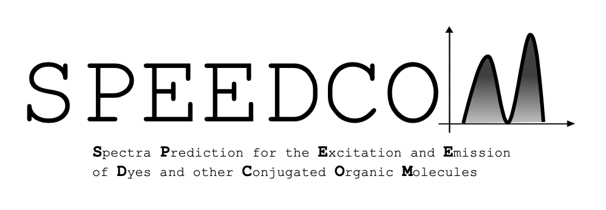

[//]: comment (_**S**pectra **P**rediction for the **E**xcitation and **E**mission of **D**yes and other **C**onjugated **O**rganic **M**olecules_)

 Authors: **Joseph Abbott**, **Ryan Beck**, **Hang Hu**, **Yang Liu**, **Lixin Lu**. 

## Overview

_SPEEDCOM_ is an open source python package that aims to predict the fluorescence emission and absorption spectra of small conjugated organic molecules. These features are predicted using a neural network, implemented with [keras](https://github.com/keras-team/keras), and are trained on data from the [PhotochemCAD database](http://www.photochemcad.com/PhotochemCAD.html). The software has a graphical-user-interface (GUI) where users can input the [SMILES](https://en.wikipedia.org/wiki/Simplified_molecular-input_line-entry_system) string for a given molecule and be returned its predicted spectra. 

## Configuration

## Contributions

Any contributions to the project are warmly welcomed! If you discover any bugs, please report them in the [issues section](https://github.com/emissible/SPEEDCOM/issues) of this repository. 

## License

SPEEDCOM is licensed under the [MIT license](https://github.com/emissible/SPEEDCOM/blob/master/LICENSE).
