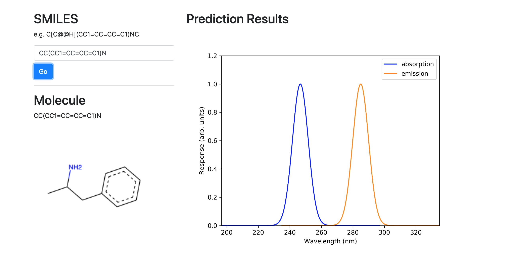
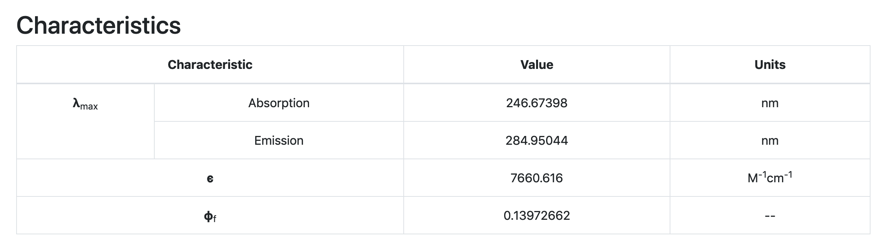

Authors: **Joe Abbott**, **Ryan Beck**, **Hang Hu**, **Yang Liu**, **Lixin Lu**.

----

### Overview

_SPEEDCOM_ is an open source python package that aims to predict the fluorescence emission and absorption spectra of small conjugated organic molecules. These features are predicted using a convolutional neural network, implemented with [keras](https://github.com/keras-team/keras), and trained on data from the [PhotochemCAD database](http://www.photochemcad.com/PhotochemCAD.html). The software has a graphical-user-interface (GUI) where users can input the [SMILES](https://en.wikipedia.org/wiki/Simplified_molecular-input_line-entry_system) string for a given molecule and be returned its predicted spectra and associated characteristic quantities. For further details on the background science, and the operations of our program, please see our [use cases](https://github.com/emissible/SPEEDCOM/blob/master/use_cases.md).

----

### Current Features
* Input vaild SMILES of small organic molecules as input for prediction
* Predictions on the maximum absorption/emission peak
* Wrapper functions for a numerial encoding of SMILES and common descriptors generation
* GUI on local host

----

### Incoming Featrues
* Sanitize SMILES input; add alternative input options
* Predictions on multiple peaks of absorption/emission spectra
* Customization of model training with user input data
* Pipelining predictions to facilitate fluorophore design 

----

### GUI

Below shows the spectra and characteristics prediction of an example molecule, inputted via our GUI.

----

### Configuration

#### Pre-requirements:

* Python version 3.6.7 or later
* conda version 4.6.8 or later
* GitHub 

#### Installation & Usage Instructions

You can execute the following ``commands`` from your computer's terminal application: 

1. Either clone the _SPEEDCOM_ repository:

	``git clone https://github.com/emissible/SPEEDCOM.git ``  
	
	or download the zip file:  
	
	`` curl -O https://github.com/emissible/SPEEDCOM/archive/master.zip ``
	
2. `` cd SPEEDCOM ``
	
2. ``conda env create -n speedcom_environment.yml``

3. ``conda activate speedcom``

4. ``cd speedcom && python runhtml.py``

5. Find the isomeric SMILES string for the moelcule you want the spectra for and input it into the GUI!

----

### Directory Structure

	SPEEDCOM (master)  
    |---data  
        |--- 
    |---doc  
        |--- 
    |---speedcom  
        |---frontend
            |---output
            |--jquery.min.js
            |--molecule_ex.png
            |--spectra_ex.png
            |--welcome.png
        |---notebook_scripts
            |--R2_plot.ipynb
            |--encode_smiles.ipynb
            |--rdkit_descriptor.ipynb
            |--rdkit_exploration.ipynb
            |--smiles_clean.ipynb
            |--smiles_cnn.ipynb
            |--to_help_write_tests.ipynb
        |---saved_models
            |--ems_dropna.best1.hdf5
            |--epsilon.best_-1.hdf5
            |--model_lstm_qy.json
            |--model_smiles_cnn.json
            |--model_smiles_ems_dropna.json
            |--model_smiles_epsilon_lstm.json
            |--smiles_wordmap.json
            |--weights.best.hdf5
            |--weight.qy_best.hdf5
        |---tests
            |---DATA_CLEAN_TEST_DIR
            |--__init__.py
            |--context,py
            |--tests_NNModels.py
            |--test_Prediction.py
            |--test_dataUtils.py
        	  |--test_data_extract.py
         	  |--test_model_utils.py
         	  |--test_readData_temp.tsv
         	  |--test_speedcom.py
         	  |--test_utilities.py
        |--NNModels.py
        |--Prediction.py
        |--__init__.py
        |--core.py
        |--dataUtils.py
        |--data_extract.py
        |--matplotlibrc
        |--model_utils.py
        |--runhtml.py
        |--speedcom.html
        |--utilities.py
        |--version.py  
    |--.coveragerc
    |--.gitignore  
    |--.travis.yml
    |--LICENSE  
    |--README.md 
    |--download.sh
    |--numpyversion.py
    |--requirements.txt
    |--runtests.sh
    |--setup.sh
    |--speedcom_environment.yml 

----

### Contributions

Any contributions to the project are warmly welcomed! If you discover any bugs, please report them in the [issues section](https://github.com/emissible/SPEEDCOM/issues) of this repository and we'll work to sort them out as soon as possible. If you have data that you think will be good to train our model on, please contact one of the authors. 

----
### References

Garrett B. Goh et al. 2018. SMILES2vec. In Proceedings of ACM SIGKDD Conference, London, UK, Aug, 2018 (KDD 2018), 8 pages

----

### License

SPEEDCOM is licensed under the [MIT license](https://github.com/emissible/SPEEDCOM/blob/master/LICENSE).
