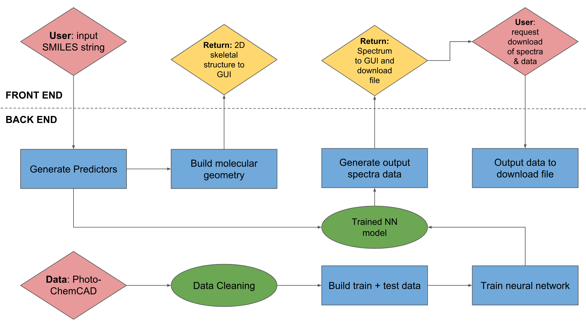

# Use Cases

## Background

A molecule in its ground electronic state becomes excited upon the **absorption** of a photon, entering a higher electronic and vibrational state. The molecule can then relax to a lower vibrational state through some energy exchange with the environment that usually accompanies the reorganization of molecular geometry. From there, the relaxation of the molecule to a lower electronic state (such as the ground state) results in the **emission** of a photon. 

Structures that exhibit this behaviour on a short enough timescale are known as _fluorophores_, and result in different molecules having different characteristic wavelengths of absorption  and emission . These can be determined experimentally by spectroscopy, as well as theoretically through _ab initio_ calculations. 

Other quantities characteristic for a certain molecule are the **molar extinction coefficient**  - which represents the extent to which light is absorbed at a given wavelength - and the **quantum yield**  - which represents the ratio of quanta (packets of energy with a certain wavelength) absorbed to those emitted.

## Objectives

The objective of _SPEEDCOM_ is simple: to use a convolutional neural network to generate the emission and absorption spectra of small organic molecules quickly and accurately, without the need for running expensive and time consuming _ab intio_ calculations.

## Components

### <u>Front End</u>

### GUI
User interactions are handled through our Graphical User Interface (GUI). Here the user inputs a SMILES string for the molecule for which they would like to generate a spectrum. This string is passed to the data-cleaning portion of our program in the back end.

The user can then choose between the generation of an emission or an absorption spectra for the fluorescence of their molecule. This is displayed in the GUI, along with the skeletal, 2D representation of their molecule. The user can check this structure to see if they are receiving the spectra for the molecule they are expecting to.

The user may also choose to download the spectra and associated calculated physical quantities, such as , ,  and .

### <u>Back End</u>

### Data Cleaning

The SMILES string for the molecule is received from the front end GUI. Any counterions present are removed from the structures as they have no fixed coordinates relative to the molecule as a whole, and have no tangible effects on the electronic behaviour of the molecule with regard to its absorption and emission wavelengths.

### Neural Network

**Descriptors for the molecule may be generated in the following ways:**

1. After being converted into a 3D geometry, the nuclear coordinates and atomic charges are used to generate a _Coulomb Matrix_, which is useful representation of molecular geometry. This may be encoded and passed into a Deep Neural Network (DNN).

2. Using RDKit - an open source python package used for processing chemical data - a unique 'fingerprint' for the molecule may be generated, which can be passed into a Convolutional Neural Network (CNN).

3. Numerical encoding of this figerprint can be passed through a 'Long-Short-Term-Memory' Recurrent Neural Network (RNN).

4. However, the model that has given us the best accuracy upon predicting the spectroscopic details of molecules in our test data has been a CNN trained on numerically-encoded SMILES strings themselves. 

**Implementation:**

Our CNN is implemented with [keras](https://github.com/keras-team/keras), an open-source high-level neural-network programming interface. 