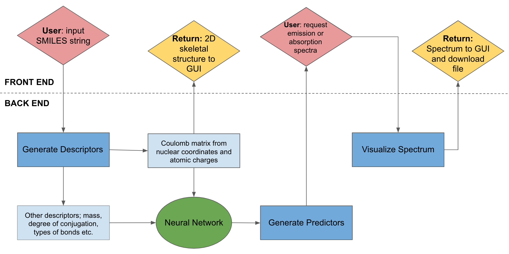

# Use Cases
## Background

## Objectives

The objective of _SPEEDCOM_ is simple: to use deep-learning to generate fluorescence emission and absorption spectra quickly and accurately, without the need for running expensive and time consuming _ab intio_ calculations.

## Components

### <u>Front End</u>

#### GUI
User interactions are handled through our Graphical User Interface (GUI). Here the user inputs a SMILES string for the molecule for which they would like to generate a spectrum. This string is passed to the data-cleaning portion of our program in the back end.

The user can then choose between the generation of an emission or an absorption spectra for the fluorescence of their molecule. This is displayed in the GUI, along with the skeletal, 2D representation of their molecule. The user can check this structure to see if they are receiving the spectra for the molecule they are expecting to.

The user may also choose to download the spectra and associated calculated physical quantities, such as $\lambda_{ems}$, $\lambda_{abs}$, $\phi_{f}$ and $\epsilon$.

### <u>Back End</u>

#### Data Cleaning

The SMILES string for the molecule is received from the front end GUI. After being converted into an approximate 3D geometry, the nuclear coordinates and atomic charges are used to generate a _Coulomb Matrix_, which is useful representation of molecular geometry 

#### Neural Network

Because of the complexity and quantity of the descriptors attributed to each molecule, our program involves the utilization of a neural network to build the predictors. This is implemented with [keras](https://github.com/keras-team/keras), an open-source high-level neural-network programming interface. 